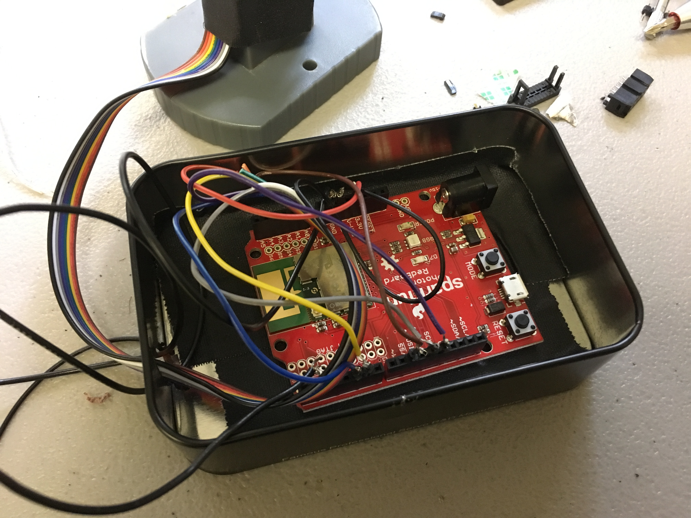
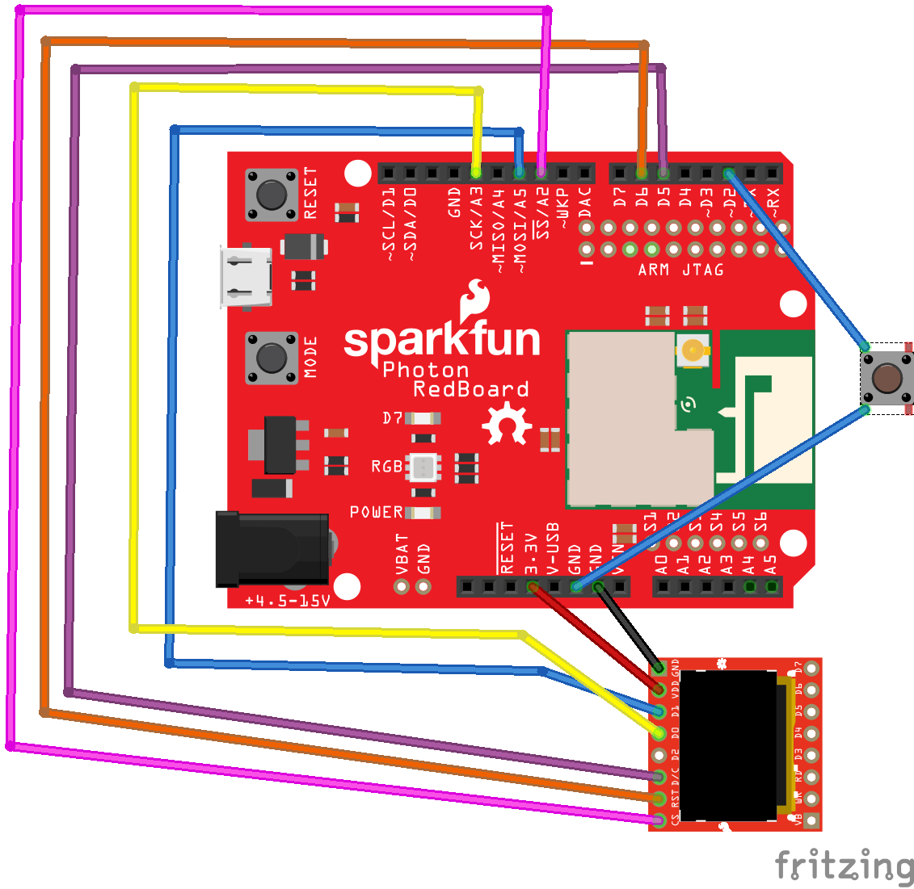

# Midterm IoT Project

Name: Rebecca Uliasz 

Date: 10/11/2017

## Project: Insecure Cam

### Conceptual Description

///Building off of my thinking into private IP security cameras and digging deeper into databased that collect insecure or weakly secured camera addresses, I started thinking through what it means for a consumer to purchase an object with the intent of increasing their security and the convenience of ensuring their security, while at the same time sacrificing their privacy by the nature of connecting to the internet. The irony of these cameras is heightened by the apparent fact that, upon scrolling through one of these so-called advocate of privacy websites, most of the cameras seem to be completely useless as it is, pointed as corners or so washed out or dirty that it is imposible to make out any sort of image of value on the screen. Even if the image streams are viable, how useful are they actually to the person to whom they belong? It is doubtful that most of the cameras are monitored by human eyes, so it seems that these devices have a different type of security value than they might reveal at surface level. Rather than preventative, they are reassuring. Their presence lends to a homeowner's peace of mind. 

I recently moved into a new house that had been abandon for a few years and the only item in the entire vicinity was one cheap and chintzy looking webcam. When I took it apart, I was quite amused to find out that it was a fake. I had not known that it is common for homeowners use these props as decoys agaist potential criminals. Here was a very potent example of an object-as-secrity, but the value in the security here was entirely a psychological trick. What other kinds of devices and objects provide this type of peace-of-mind in a way that has little or nothing to do with their function? I began to conceptualize a security camera that would give this sense of self-assured protection to the consumer while also not putting their image at risk for appearance on the world wide web of voyeurs. Thus, the Insecure Cam was born, a security camera that will send you positive affirmations, but only while you are holding it. Otherwise, you leave yourself at risk of feeling insecure, posing greater and greater risk to your ego. ///

### Form

/// The Insecure Cam (beta model) is built using a Sparkfun Photon Redboard, OLED Microdisplay, push button and cables. It is designed to be held in a way where the button is pressed down, allowing the camera to know when to send you positive affirmations in the form of tweets tagged with an #affirmation. When the button is released or the camera is set down, the screen will display warnings that you are currently insecure. The camera is housed inside a repurposed decoy security camera. It now comes with the added feature of monitoring your baby, and will send you a message every minute that your baby has not fallen over, simply adding to your extended peace and comfort of mind.  ///

**Finished Enclosure:**


**Electronics Exposed:**




### Technical Details
//   
* list of hardware used
  - Photon Redboard
  - Micro LED
  - push button 
  - breadboard cables 
  
The code below is the handler function for the Tweet subscription. I used IFTTT to subscribe to tweets with the hashtag #affirmation. I am using the handler to both print the tweets to serial in order to monitor, and also converting them to a string to print to the LED screen, which I have called oled below... 
 

//

You can include code snippets here:

```
void print2lcd(const char *event, const char *data) {
    
  i++;  // increment counter upon msg received
  Serial.print(i);      // optional for troubleshooting, prints counter to serial
  Serial.println(event);  // optional for troubleshooting, prints Particle event name to serial
  
  if (data){
    Serial.print(", data: "); // optional for troubleshooting
    Serial.println(data); // optional for troubleshooting, prints Particle event data to serial
    
    String data_as_string(data);  // ***** this is important, convert char * to string for OLED printing
//    myList.push_front(data_as_string); 
    
    oled.clear(PAGE);
    oled.setCursor(0, 0);
    
     int buttonState = digitalRead(buttonPin); 
 
if (buttonState == LOW){   
    oled.println(data_as_string);  // print the Particle event data

    oled.display(); // Draw to the screen
    delay(500); 
}
```


**Wiring Diagram**


